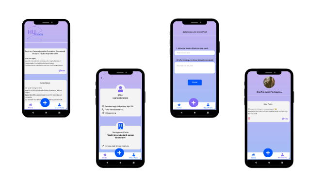

# HUBusca

<h1 align="center">
    
</h1>

 

## 🧾 Sobre a  aplicação
Esse aplicativo criado em React Native + Expo consiste em um app fictício que consome uma api falsa gratuita, disponível aqui. 
Ele lista as postagens fornecidas pelo servidor, mostra informações do usuário que a criou, cria postagens localmente e exclui postagens localmente. 
A api possibilita criar e excluir postagens, mas a ação não gera uma alteração real na base de dados, devido a isso, foi utilizado o armazenamento local. 

 

## ✨ O que foi utilizado?
Esse projeto foi desenvolvido em TypeScript e fez uso das seguintes dependências mais importantes:
- **Styled-Component**, para tratar os estilos da aplicação.
- **Axios**, para fazer a conexão com a api
- **Async Storage**, como forma de armazenamento local das postagens
- **Contexto do React (useContext, createContext)**, para globalizar o acesso aos hooks personalizados da aplicação
- **A lib react-native-svg**, para lidar com imagens/ícones svg
- **Expo-fonts**, para uso da fonte Poppins
- **Mensagens toast**, para informar ao usuário o cadastro e exclusão de posts 

 

## 💡 Como funciona?
A aplicação utiliza um menu Tab Button para a navegação.

Ao abrir o aplicativo, após a splash screen, é exibido a tela Home. 
Nela, há um scroll infinito com todas as postagens fornecidas pela api, dispostas em cards contendo nome, descrição e autor. 
Ao clicar no autor da postagem, é aberto a tela onde mostra as informações pessoais desse autor e de sua organização.

Ao clicar no ícone "mais" do menu, é abeto a tela de cadastro de posts. 
Nela é possível cadastrar um novo post fornecendo seu título e descrição. 
Ao clicar em enviar, o post é cadastrado e o usuário é encaminhado para a tela de perfil, onde é possível ver a lista com todos seus posts. 
Caso essa lista esteja vazia, uma mensagem informando essa situação será mostrada.
 

 <h1 align="center">
    
</h1>

 

## 🚀 Como testar na minha máquina?
1. Clone esse repositório: `https://github.com/Nuri-an/HUBusca.git`
2. Instale as dependências: `yarn`, `yarn install` ou `npm install`
3. Inicie o projeto: `expo start`, `npm start` ou `yarn start`
4. Siga as [instruções do Expo](https://docs.expo.io/guides/testing-on-devices/) para rodar o projeto em um emulador Android ou iOS, 
ou em celular físico através do app Expo disponível nas lojas de aplicativos. Nesse último caso, basta ler o qrCode disponível na tela.
5. Se preferir, baixe o apk disponível [aqui]() (apenas android)

  
